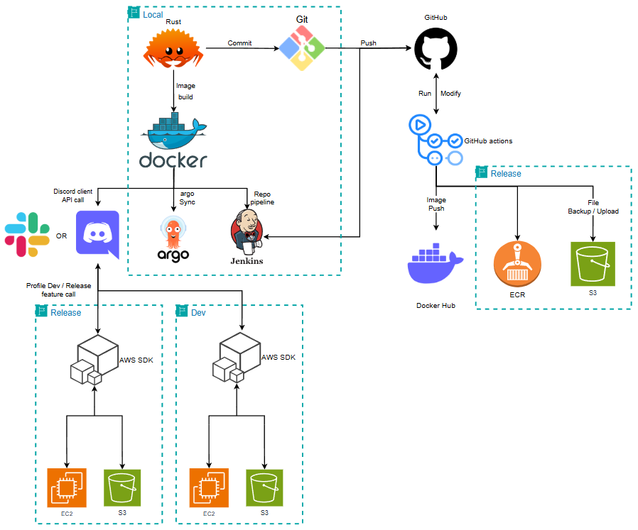

# Discord bot and AWS resource control Project

## Project information
* Member :  
  [PITLANE](https://github.com/gunwoo8873), [zxcxz01](https://github.com/zxcxz01), [sssoeun](https://github.com/sssoeun), [Byun-Sung-Ho](https://github.com/Byun-Sung-Ho)
* Dev date :  
  2025. 01. ~ **
* Discriotion :  
  This project is Discord bot and AWS cloud system status checking for on the rust language
  
> [1. Team Project : AWS Service bedrock agent](https://github.com/Byun-Sung-Ho/appCodeForRocket)  
> [2. Discord-Bot NET.ver](https://github.com/gunwoo8873/NET-DiscordBot)

## Docker architecture
<figure align="center">
  
</figure>

## Discord architecture
<figure align="center">
  
</figure>

## Getting start guide
### Cargo lib
* **rustup** : need to toolchain version is `nightly`
* **serenity** : Discord bot for rust programing language
* **dotenv** : read to .env file and need to add std::env
* **tokio** : async thread feture
* **mysql** : using for global slash command data save

  ### Cargo.toml lib
  ```toml
  # Path : ./discord_bot/Cargo.toml

  # Discord bot project base lib
  [dependencies.serenity]
  default-features = false
  version = "0.12.4"
  features = [
      "builder",
      "chrono",
      "client",
      "collector",
      "framework",
      "gateway",
      "http",
      "model",
      "standard_framework",
      "utils",
      "rustls_backend",
  ]

  # Http protocol async feature lib
  [dependencies.tokio]
  version = "1.43.0"
  features = ["full"]

  # Read to .env file lib
  [dependencies.dotenv]
  version = "0.15.0"

  # Database async feature lib
  [dependencies.sqlx]
  default-features = false
  version = "0.8.3"
  features = ["runtime-tokio", "mysql", "macros", "time"]
  ```

  ## Project run cmd
  ```bash
  # Path : ./discord_bot
  cargo build --release
  ```

  ```bash
  cargo run
  ```

### Discord
> That Discord and MySQL database client connected

  * ### Config
    ```env
    # Path : /Discord-Bot/.env
    DISCORD_BOT_TOKEN=YOUR_DISCORD_BOT_TOKEN
    GUILD_ID=YOUR_DISCORD_GUILD_ID
    RUST_LOG=debug
  
    MYSQL_HOSTNAME=YOUR_MYSQL_DB_HOSTNAME
    MYSQL_PORT=YOUR_MYSQL_DB_PORT
    MYSQL_USERNAME=YOUR_MYSQL_DB_USERNAME
    MYSQL_PASSWORD=YOUR_MYSQL_DB_PASSWORD
    MYSQL_DATABASE_NAME=YOUR_MYSQL_DB_NAME
  
    # Sub MySQL connection URL
    MYSQL_URL=YOUR_MYSQL_DB_URL
    ```


### AWS
> To be reference web site is [AWS SDK Rust](https://docs.aws.amazon.com/sdk-for-rust/latest/dg/credentials.html)

  * ### Config
    ```config
    # Path : /Discord-Bot/config and ~/.ssh/config
    [default]
    region = YOUR_USED_REGION
    aws_access_key_id = YOUR_AWS_IAM_ACCESS_KEY
    aws_secret_access_key = YOUR_AWS_IAM_SECRET_ACCESS_KEY
    output = json
    ```
